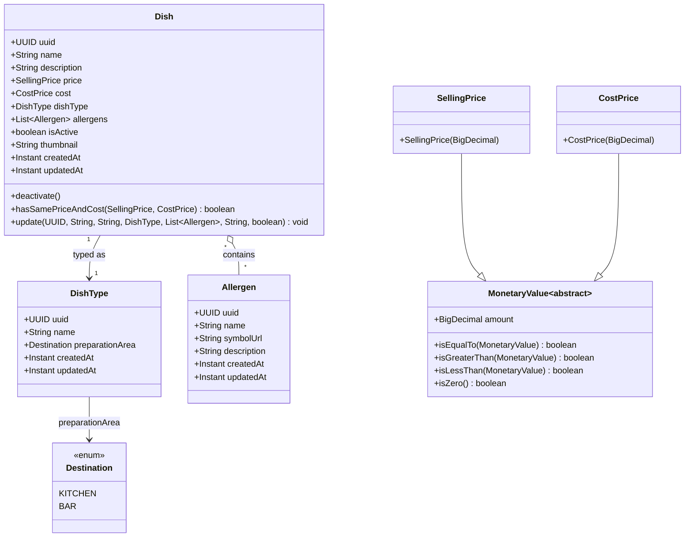
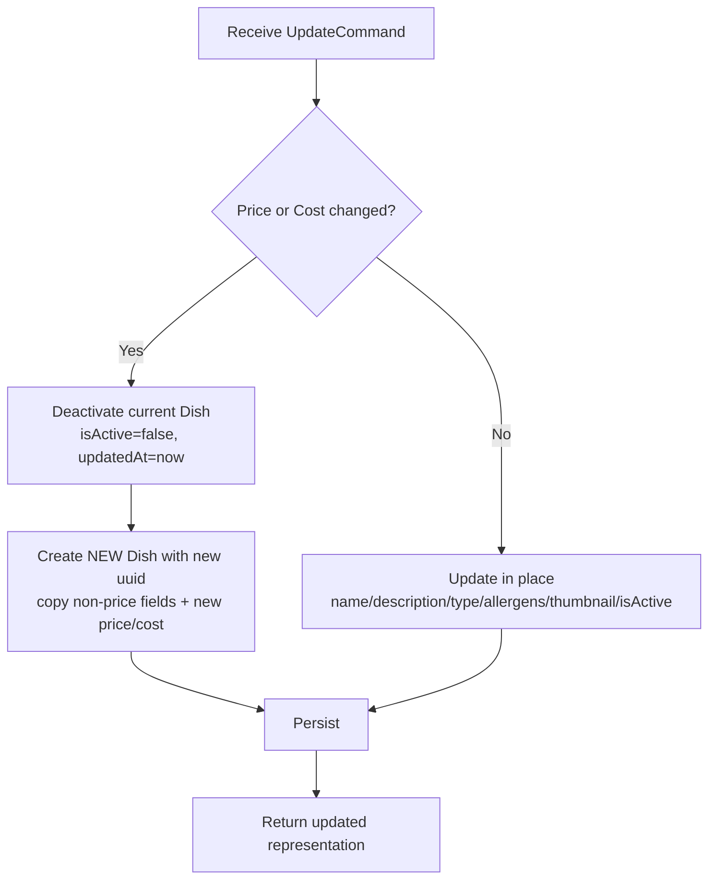
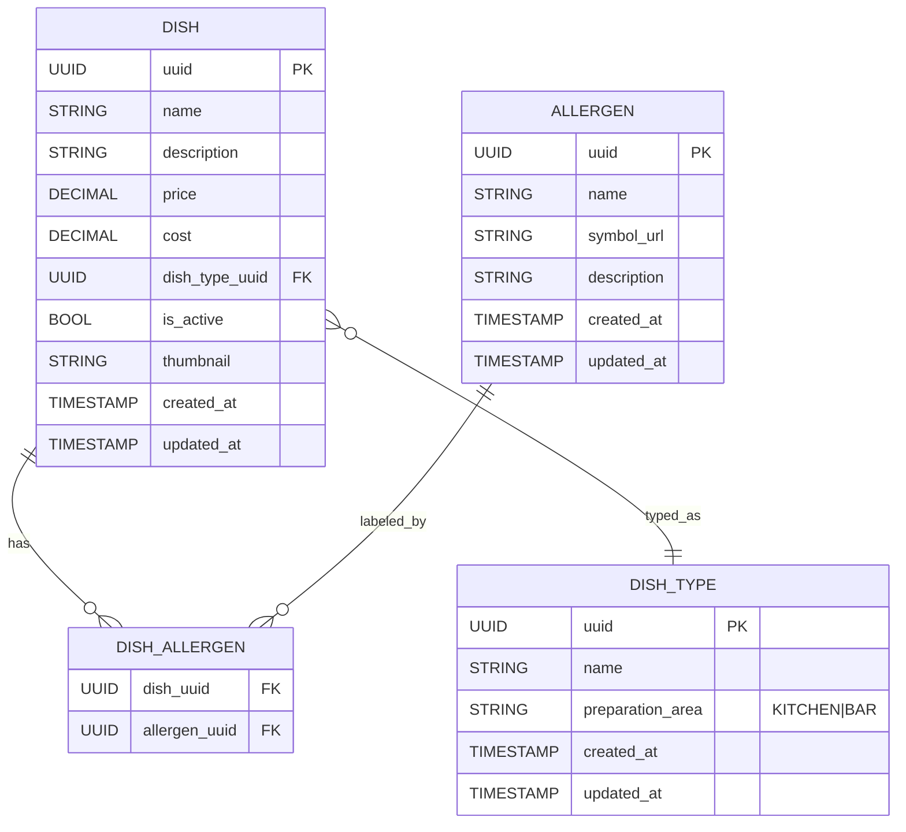

# Tablease — Menu Service Documentation

**Module:** Menu Service  
**Context:** Menu & Product Catalog (bounded context)  
**Tech stack:** Java 21 · Spring Boot 3.5 · Maven  
**Last updated:** 2025-08-12 20:41 (auto-generated from domain classes in this workspace)

---

## 1) Purpose & Responsibilities

The **Menu Service** manages the restaurant’s **dishes**, **dish types**, allergens, and pricing information. It is the source of truth for what can be sold and how it is presented. Data is never hard-deleted. Instead, the service deactivates records to preserve history for analytics.

**Aggregate root:** `Dish`  
**Supporting entities/VOs:** `DishType`, `Allergen`, `SellingPrice`, `CostPrice`, `MonetaryValue` (abstract), `Destination` (enum).

---

## 2) Domain model (from current code)


_Source: parsed from project classes in this repository._

---

## 3) Business rules (CRUD with historical integrity)

### Create
**Required:** `uuid`, `name` (non blank), optional `description` (**<= 400 chars**), **valid `DishType`**, `price`, `cost`.  
Validations (from code):
- `uuid` **must not** be null
- `name` **must not** be null/blank (trimmed)
- `description` allowed to be null but **must be ≤ 400 characters**
- `dishType` **must not** be null
- `SellingPrice` / `CostPrice` **must be ≥ 0** (`MonetaryValue` validates)

Side effects:
- `isActive = true`
- `createdAt = now`, `updatedAt = createdAt`
- `thumbnail` is normalized to null if blank

### Read
- By `uuid` or list/pagination. Only **active dishes** should be shown to customers by default; admins may query all.

### Update
There are **two cases**:
1. **Price or cost changes** → **Versioning**:  
   - Deactivate current dish (`isActive=false`, `updatedAt=now`)  
   - Create a **new Dish** with updated price/cost (new `uuid`, fresh timestamps).  
   - Rationale: preserve a full price/cost history for analytics.
2. **No price/cost change** → **In-place update** of non-financial data (e.g., `name`, `description`, `dishType`, `allergens`, `thumbnail`, `isActive`).

**Price/cost comparison rule:** `hasSamePriceAndCost(SellingPrice, CostPrice)` compares `BigDecimal amount` of value objects.

### Delete
- **Never hard-delete.** Deactivate only (logical delete) to preserve historical records for reporting.

---

## 4) Update flow (decision chart)



---

## 5) Entity details & invariants

### 5.1 Dish (Aggregate Root)
- **Identity:** `uuid` (immutable)  
- **Data:** `name`, `description?`, `price: SellingPrice`, `cost: CostPrice`, `dishType`, `allergens[]`, `thumbnail?`, `isActive`  
- **Timestamps:** `createdAt` (immutable), `updatedAt`  
- **Invariants:**
  - `uuid != null`
  - `name` not blank
  - `description` length ≤ 400 (if present)
  - `dishType != null`
  - `price.amount >= 0`, `cost.amount >= 0`

**Notes**
- `thumbnail` is trimmed and normalized to `null` when blank.
- `allergens` are stored as an **immutable copy** (`List.copyOf(...)`) at construction time for safety.

### 5.2 DishType
- **Fields:** `uuid`, `name` (not blank), `preparationArea: Destination` (required), `createdAt`, `updatedAt`  
- **Purpose:** Encodes the place where the dish is prepared (e.g., **KITCHEN** vs **BAR**) and groups dishes logically (e.g., *Pizza*, *Cocktail*, *Dessert*).

### 5.3 Allergen
- **Fields:** `uuid`, `name` (not blank), `symbolUrl?`, `description?`, `createdAt`, `updatedAt`  
- **Purpose:** Drives allergen labeling in menus and UIs.

### 5.4 MonetaryValue + Price VOs
- `MonetaryValue` is an **abstract, immutable** base class holding a `BigDecimal amount` and helpers for comparison.  
- `SellingPrice` and `CostPrice` **forbid negative values** in constructors.

### 5.5 Destination (enum)
- `KITCHEN`, `BAR` — used by `DishType.preparationArea` to route preparation to the correct station.

---

## 6) Persistence and versioning strategy

- **Logical deletes** via `isActive=false`; **no hard deletes.**
- **Versioning on price/cost changes**: snapshot with a **new `Dish`** instance (new `uuid`).  
- Suggested relational mapping:
  - `dish(uuid PK, name, description, price, cost, dish_type_uuid FK, is_active, thumbnail, created_at, updated_at)`
  - `dish_allergen(dish_uuid FK, allergen_uuid FK, PRIMARY KEY(dish_uuid, allergen_uuid))`
  - `dish_type(uuid PK, name, preparation_area, created_at, updated_at)`
  - `allergen(uuid PK, name, symbol_url, description, created_at, updated_at)`

**Indexes**
- `dish(is_active)`, `dish(dish_type_uuid)`, `dish(created_at)` to speed common queries.
- `dish_allergen(dish_uuid)`, `dish_allergen(allergen_uuid)`.

**Alternative (history table)**
- Keep a stable `dish_id` and versioned `dish_version` rows. Current code favors **new UUID per price change** which is simpler and works well in event-driven read models.

---

## 7) Suggested API (REST) — draft

> The code shown is **domain-only**. Below is a suggested HTTP API for the service.

- `POST /api/menu/dishes` → create dish  
- `GET /api/menu/dishes/{uuid}` → get by id  
- `GET /api/menu/dishes?active=true&type={dishTypeUuid}&q=...` → search/list  
- `PUT /api/menu/dishes/{uuid}` → update (detect price/cost changes inside the application service; if changed, **deactivate** and **create new**)  
- `DELETE /api/menu/dishes/{uuid}` → **deactivate** (logical delete)  

**HTTP semantics**
- `DELETE` returns 204 and toggles `isActive=false`.
- `PUT` returns 200 with either the updated entity (no price change) or the **new** entity created (price change). Include a header like `X-Entity-Versioned: true` when a new uuid was created.

---

## 8) Validation & error handling

- **400** for invalid input: blank name, description > 400, negative prices, missing dishType.
- **404** when dish not found (or not visible under current scope).  
- **409** if attempting to create a duplicate UUID (should never happen if UUIDs are random).

**Defensive rules implemented in domain:**
- String trimming & normalization to null.
- `List.copyOf(allergens)` to avoid external mutation.
- Monetary value validation in constructors.

---

## 9) Application & architecture notes

- Keep domain free of framework dependencies (already true).  
- Implement **use cases** in application layer:
  - `CreateDishUseCase`
  - `UpdateDishUseCase` (contains the **versioning decision**)
  - `DeactivateDishUseCase`
  - `GetDishUseCase` / `ListDishesUseCase`
- Use **DTOs** for I/O; map to domain objects in the app layer.  
- Publish **domain events** (optional) on state changes:
  - `DishCreated`, `DishUpdated`, `DishVersioned`, `DishDeactivated`
- Consider **idempotency keys** on create to avoid duplicates under retries.  
- Add **outbox** pattern if events are emitted.

---

## 10) Example payloads

**Create Dish**
```json
{
  "name": "Margherita Pizza",
  "description": "Classic pizza with tomato, mozzarella and basil.",
  "price": 12.50,
  "cost": 4.10,
  "dishTypeUuid": "aaaaaaaa-bbbb-cccc-dddd-eeeeeeeeeeee",
  "allergenUuids": ["11111111-2222-3333-4444-555555555555"],
  "thumbnail": "https://cdn.example/menu/margherita.png"
}
```

**Update Dish (no price change)**
```json
{
  "name": "Margherita Pizza (Large)",
  "description": "Large size",
  "dishTypeUuid": "aaaaaaaa-bbbb-cccc-dddd-eeeeeeeeeeee",
  "allergenUuids": ["11111111-2222-3333-4444-555555555555"],
  "thumbnail": null,
  "isActive": true
}
```

**Update Dish (price change → versioning)**
```json
{
  "price": 13.00,
  "cost": 4.20
}
```

---

## 11) ER-style view (storage-oriented)



---

## 12) Testing guidance

- **Unit tests** at domain: constructor validation, `deactivate()`, `hasSamePriceAndCost()`, trim/normalization.  
- **Use case tests**: update with/without price change, deactivate flow, list filters (active only).  
- **Contract tests** for API resources.  
- **Migration tests** if schema evolves (e.g., adding `thumbnail`).

---

## 13) Open questions / next steps

- Should we explicitly store a **price history** table in addition to versioning by new `uuid`?  
- Do we need **soft-unique** constraints on `(name, dishType)` for active dishes?  
- Should allergens be **tenant-configurable** (multi-restaurant scenario)?  
- Define **DTOs and mappers** (e.g., MapStruct) and persistence models (JPA or MyBatis).

---

## 14) Changelog (domain)

- Introduced `thumbnail` with normalization to null if blank.
- `Dish.update(...)` path supports full in-place updates when price/cost unchanged.
- Monetary value classes enforce non-negativity.

---

> _This document was generated and curated from the current Java domain classes. Keep it in sync as the service evolves._
